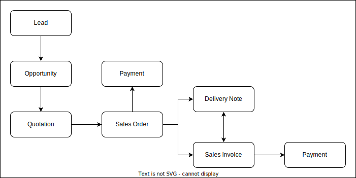

# Sales Order

<figure><figcaption></figcaption></figure>

## Sales Order

**Sales Order** adalah dokumen yang digunakan untuk merekam pesanan yang diterima dari pelanggan untuk membeli produk atau jasa.

### Logika&#x20;

* **Sales Order** milik [**Company**](../core-concept/#company-perusahaan)****
* **Sales Order** milik [**Sales Partner**](sales-partner.md)****
* **Sales Order** milik **Salesperson**
* **Sales Order** dapat dikaitkan dengan **Quotation**
* **Sales Order** dapat menjadi [**Sales Order**](sales-order.md)****
* **Sales Order** memiliki 1 atau lebih [**Item**](../stock-concept/basic/item.md)****
* **Sales Order** memiliki satu [**Address** ](../crm-concept/address.md)**(Alamat)**.
* **Sales Order** memiliki satu [**Contact** ](../crm-concept/contact.md)**(Kontak)**.
* **Sales Order** memiliki 0 atau lebih **Tax**
* **Sales Order** memiliki 0 atau lebih **Charge**
* **Sales Order** dapat membuat beberapa Dokumen lain seperti (**Payment, Sales Invoice, Delivery Note, Material Request, Purchase Order)** tergantung keadaan yang ada dan **Sales Order** dijadikan sebagai referensi dari dokumen baru.

### Relasi &#x20;

* **Sales Order** belongs to a **Company**; **Company** has 0 to many **Sales Order.**
* **Sales Order** belongs to a **Sales Partner**; **Sales Partner** has 0 to many **Sales Order.**&#x20;
* **Sales Order** belongs to a **Salesperson**; **Salesperson** has 0 to many **Sales Order.**
* **Sales Order** morph to many **Addresses**; **Address** morphed by Many **Sales Order. \***&#x20;
* **Sales Order** morph to many **Contacts**; **Contact** morphed by Many **Sales Order. \***
* **Sales Order** belongs to an **Opportunity**; **Opportunity** has 0 to many **Sales Order.**
* **Sales Order** morph to many **Itemables**; **Itemables** morphed to Many **Sales Order.**
* **Sales Order** morph to many **Taxable; Taxable** morphed to Many **Sales Order**&#x20;
* **Sales Order** morph to many **Chargeable**; **Chargeable** morphed to Many **Sales Order**&#x20;

### Table Structure

